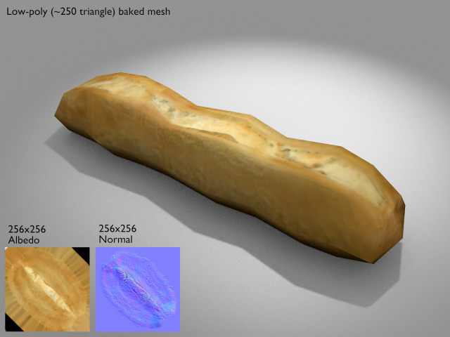
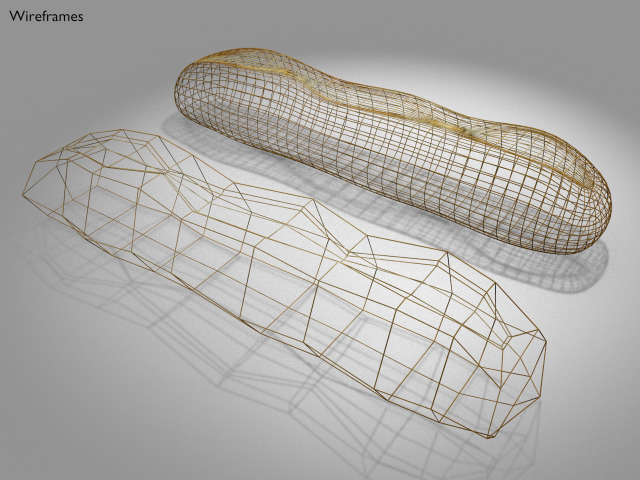

Baguette
===






License
===

```
© 2016 Mark Raynsford <visual@io7m.com>

This work is licensed under a Creative Commons Attribution 4.0
International License.

You should have received a copy of the license along with this
work. If not, see <http://creativecommons.org/licenses/by/4.0/>.

```

Scene statistics
===

```
Mesh: baguette_low_poly
  Polygons: 248
  Textures:
    Image: baguette_low_albedo 256x256
    Image: baguette_low_normal 256x256

Mesh: baguette_mesh
  Polygons: 248
  Textures:
    Image: baguette_albedo 1024x512
    Image: baguette_bump 1024x1024

```

